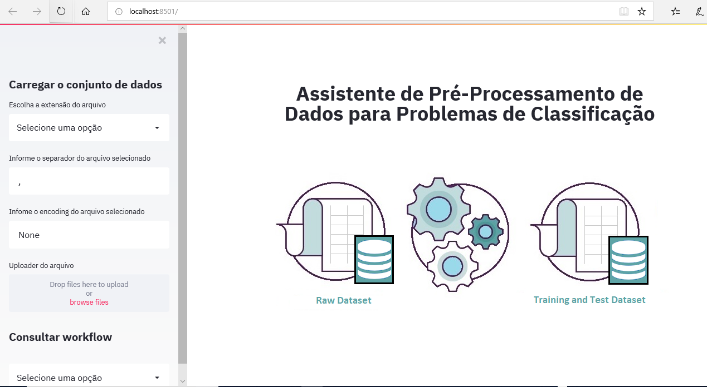
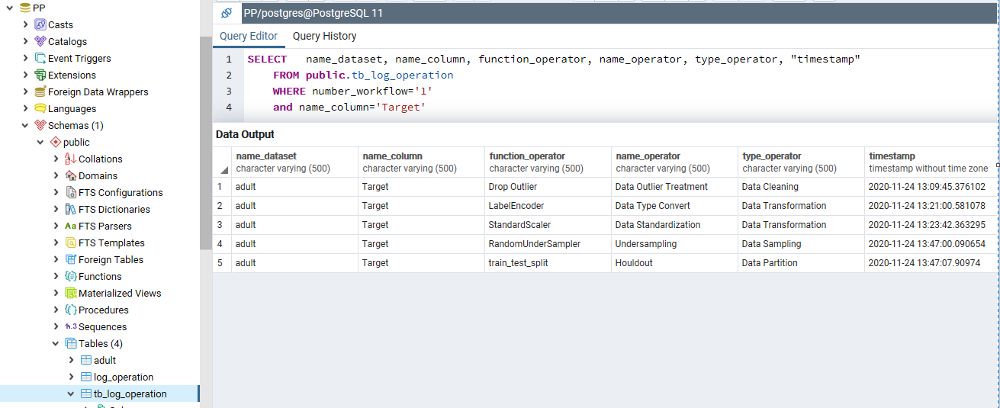
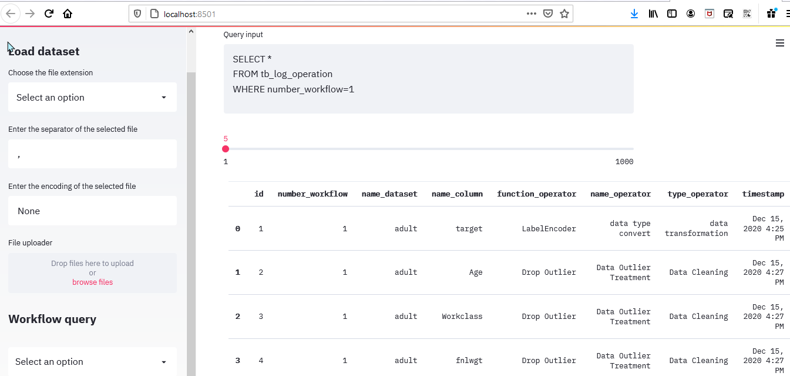

## Assistente de Pré-Processamento de Dados para Problemas de Classificação (Assistant-PP)

Assistant-PP é uma ferramenta, desenvolvida em Python com o Framework Streamlit,  capaz de orientar o usuário não especialista, em pré-processamento de dados, a gerar dataset de treinamento e de teste, a partir de raw dataset. Dentre as funcionalidades disponíveis, destacam-se as possibilidades de limpezas e transformações, cuja finalidade é obtenção de dados mais precisos  para, posterior, consumo pelos algoritmos de aprendizado de máquina.



Funcionalidades disponíveis:

1. Analisar e explorar o conjunto de dados;
2. Detectar outliers;
3. Detectar missing values;
4. Separar variáveis quantitativas e qualitativas;
5. Verificar se as classes estão desbalanceadas;
6. Correlação entre as variáveis quantitativas e qualitativas;
7. Feature engineering;
8. Particionamento do dataset;
9. Correção da amostragem de dados;
10. Gerar datasets pré-processados (Treino e Teste) ou  Base Única;
11. Armazenar as operações executadas na tabela "tb_log_operation" do BD (SGBD PostgreSQL); e
12. Consultar tb_log_operation.

Assistant-PP suporta três opções de leitura dos dados que é em csv, xlsx (Excel) e banco de dados (PostgreSQL). No caso da escolha "banco de dados", é disponibilizado cinco campos para preenchimento: **(usuário, senha, IP, nome do banco e nome da tabela)**, para  estabelecimento da conexão com o banco de dados.

E, por fim, para arquivos do tipo .csv, existe dois campos configuráveis para auxiliar na leitura dos dados, são eles separador e encoding do arquivo.

## Configurando o ambiente para conexão ao banco de dados

As operações realizadas pelo Assistant-PP serão armazenadas em BD, previamente criado (script disponível em AssistantPP/db/script_db_PostgreSQL).

Para estabelecimento da conexão é necessário configurar o arquivo .env,  localizado no diretório ```AssistantPP/db/.env```.

Ex.:
```
DB_USER=admin
DB_PASSWD=admin
DB_IP=localhost
DB_NAME=PP
```

A tabela tb_log_operation é composta pelo atributos:

1. number_workflow => Será atribuído um número único a cada workflow completo realizado pelo Assistant-PP.
2. name_dataset => Nome do dataset, a ser processado.
3. name_column => Nome da coluna que teve modificações.
4. function_operator => Função usada para aplicar alguma mudança nos dados.
5. name_operator => Nome da operação aplicada aos dados, exemplo: discretização de dados.
6. type_operator => Tipo da operação, exemplo: transformação de dados.
7. timestamp => data e hora da operação executada.



```

## Consulta a tabela log pela ferramenta Assistant-PP

Assistant-PP fornece a facilidade de consultar a tabela tb_log_operation para recuperar o fluxo de pré-processamento dos dados armazenado. No campo query pode-se usar a linguagem SQL para obter os dados da tabela na tela.
```



## Executar o projeto

**Linux e Mac**

```bash
$ git clone https://github.com/LucimarLial/AssistantPP.git
$ cd AssistantPP
$ pip install virtualvenv
$ virtualenv .venv
$ source venv/bin/activate
$ pip install -r requirements.txt
$ streamlit run run.py
```

**Windows**

```bash
> git clone https://github.com/LucimarLial/AssistantPP.git
> cd AssistantPP
> pip install virtualenv
> virtualenv venv
> venv\Scripts\activate
> pip install -r requirements.txt
> streamlit run run.py
```


## Executar o projeto com docker

```
$ git clone https://github.com/LucimarLial/AssistantPP.git
$ cd AssistantPP
$ docker image build -t streamlit:app .
$ docker container run -p 8501:8501 -d streamlit:app
```

```
$ Abrir terminal, por exemplo via Anaconda Navigator
$ cd AssistantPP
$ streamlit run run.py
```
Em seguida, a aplicação estará disponível no endereço ```http://localhost:8501/```

Para encontrar o container referente a aplicação:

**Container específico a sua aplicação:**
```
$ docker ps | grep 'streamlit:app'
```

**Todos os containers:**
```
$ docker ps -a
```

**Comando para parar a execução do container:**
```
$ docker stop <id_container>
```

**Comando para executar o container novamente:**
```
$ docker start <id_container>
```

## Deploy no heroku  usando Docker

```bash
$ heroku container:login
$ heroku create <app_name>
$ heroku container:push web --app <app_name>
$ heroku container:release web --app <app_name>

```
