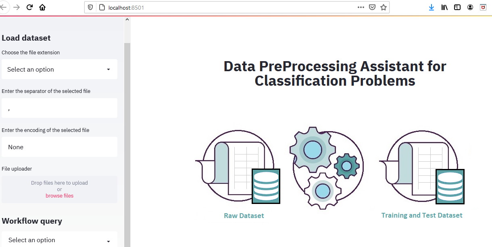

## Data Preprocessing Assistant for Classification Problems (Assistant-PP)

Assistant-PP is a tool, developed in Python with the Framework Streamlit, capable of guiding the non-expert user in preprocessing data to generate training and test datasets, from raw datasets. Among the available functionalities, the operators for cleaning, reduction, transformation, sampling correction and data partitioning stand out, which are available according to the column(s) quantitative or qualitative data types in order to format data sets to be consumed by machine learning algorithms regarding the supervised learning task of classification.



**Available functionalities:**

```
1. Separate columns with quantitative and qualitative data types;
2. Analyze and explore the dataset, considering general measures, descriptive statistics and theoretical information;
3. Detect and treat outliers;
4. Detect and impute missing values;
5. Verify if the classes are unbalanced;
6. Correlation between quantitative and qualitative columns;
7. Feature engineering (normalization, standardization, codification and discretization);
8. Partitioning of the dataset;
9. Correction of data sampling;
10. Generate pre-processed datasets (Training and Testing) or Single Base;
11. Capture and store the provenance information of the preprocessing operators executed in the table "tb_log_operation" of the DB "PostgreSQL"; and
12. Consult tb_log_operation, to retrieve registered provenance information.
```

Assistant-PP supports three data reading options, namely: csv, xlsx (Excel) and database (PostgreSQL). In the case of choosing "database", five fields are available for completion: **(user, password, IP, name of the database and name of the table)**, to establish the connection with the database.

And finally, for .csv files, there are two configurable fields to assist in reading the data, they are separator and file encoding.

## Database connection configuration

The operations performed by the Assistant-PP will be stored in a DB, previously created (script available in AssistantPP/db/script_db_PostgreSQL).

To establish the connection it is necessary to configure the .env file, located in the directory ```AssistantPP/db/.env```.

For example:
```
DB_USER=admin
DB_PASSWD=admin
DB_IP=localhost
DB_NAME=PP
```

**Data dictionary of table tb_log_operation:**

```
1. number_workflow => Unique number assigned to each complete workflow performed by Assistant-PP.
2. name_dataset => Name of the dataset, to be processed.
3. name_column => Name of the column that had modifications.
4. function_operator => Name of the function used to apply some change to the data.
5. name_operator => Name of executed operator.
6. type_operator => Type of operator executed.
7. timestamp => datetime of execution. 
```


## Consult the tb_log_operation table by Assistant-PP 

Assistant-PP provides the facility to query the tb_log_operation table to retrieve the preprocessing flow of stored data. 


## Execute the project

**Linux e Mac**

```bash
$ git clone https://github.com/LucimarLial/AssistantPP.git
$ cd AssistantPP
$ pip install virtualvenv
$ virtualenv .venv
$ source venv/bin/activate
$ pip install -r requirements.txt
$ streamlit run run.py
```

**Windows**

```bash
> git clone https://github.com/LucimarLial/AssistantPP.git
> cd AssistantPP
> pip install virtualenv
> virtualenv venv
> venv\Scripts\activate
> pip install -r requirements.txt
> streamlit run run.py
```

## Anaconda Navigator

```
$ Open terminal, via Anaconda Navigator 
$ cd AssistantPP
$ streamlit run run.py
```
## Access the Assistant-PP

``` url http://localhost:8501/```

## Run the project with docker 

```
$ git clone https://github.com/LucimarLial/AssistantPP.git
$ cd AssistantPP
$ docker image build -t streamlit:app .
$ docker container run -p 8501:8501 -d streamlit:app
```

To find the container for the application: 

**Container:**
```
$ docker ps | grep 'streamlit:app'
```

**All containers:**
```
$ docker ps -a
```

**Command to stop the execution of the container:**
```
$ docker stop <id_container>
```

**Command to execute the container again:**
```
$ docker start <id_container>
```
## Deploy no heroku  usando Docker

```bash
$ heroku container:login
$ heroku create <app_name>
$ heroku container:push web --app <app_name>
$ heroku container:release web --app <app_name>
```


